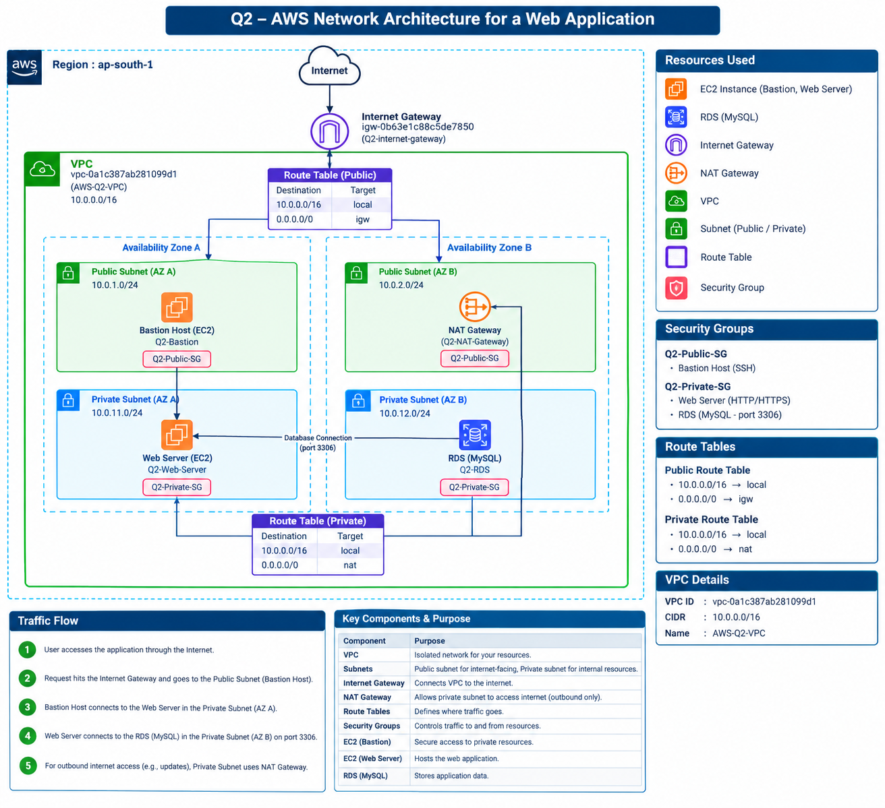
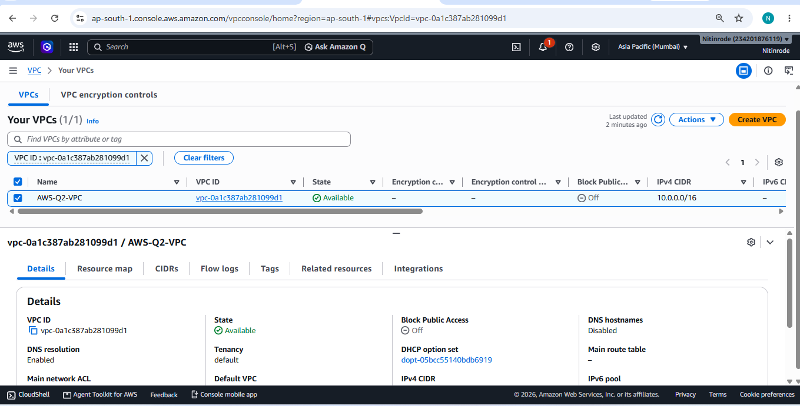
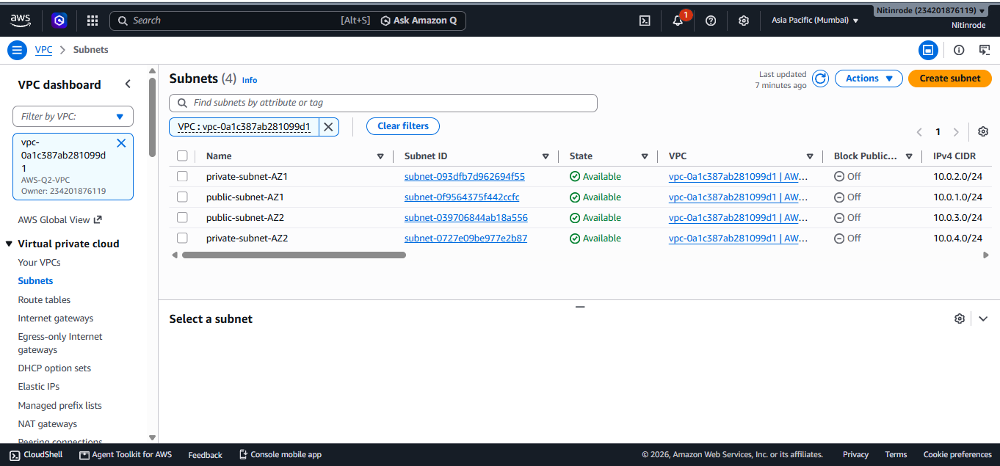
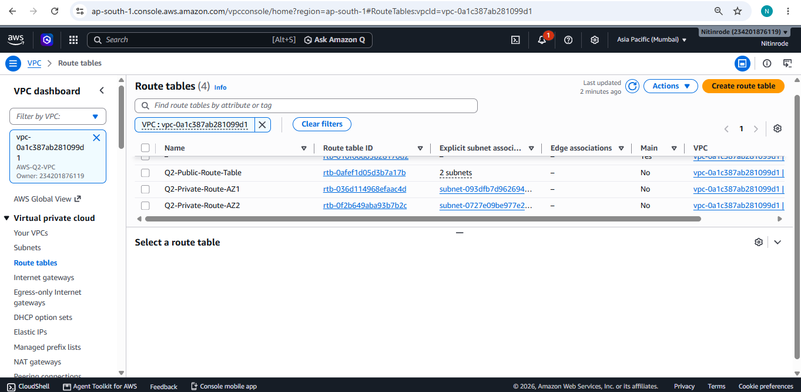
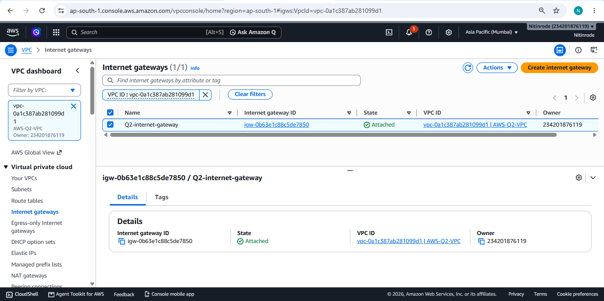
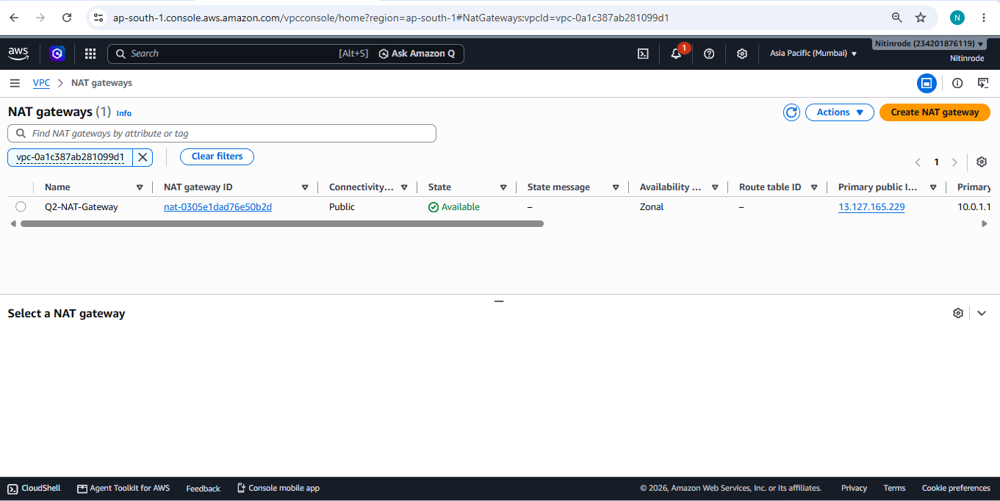
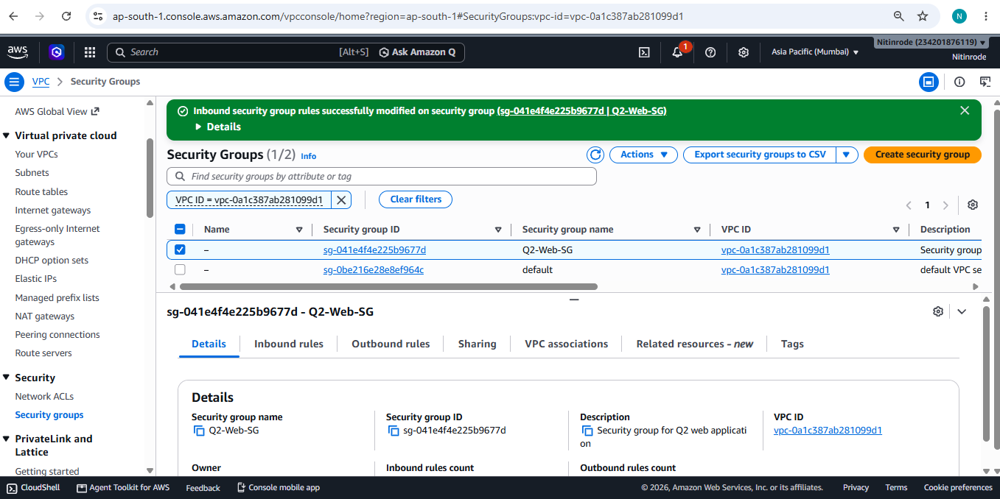
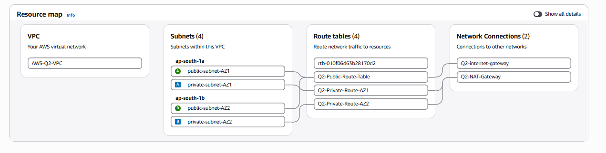
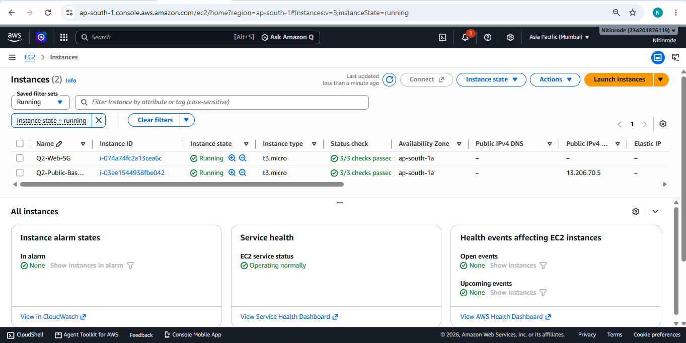
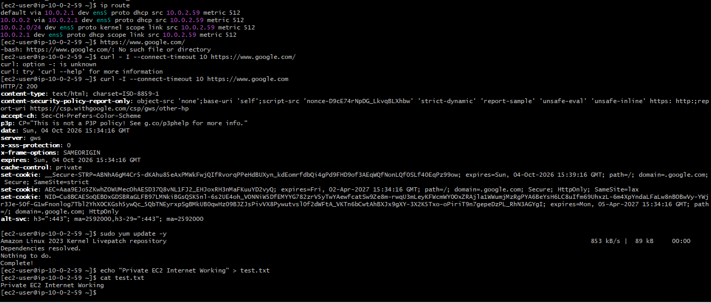

# Q2 -- AWS Network Architecture for a Web Application

## Project Overview

This project demonstrates a complete **AWS network architecture for a
web application** using a custom VPC, two Availability Zones, public and
private subnets, Internet Gateway, NAT Gateway, Route Tables, Security
Groups, and EC2 instances.

The main objective is to create a secure network structure where public
resources can communicate with the internet and private resources can
access the internet through a NAT Gateway without having a public IP.

# Architecture Diagram


 
### Architecture Flow

``` text
Internet
   |
Internet Gateway
   |
Custom VPC
   |
   +----------------------+----------------------+
   |                                             |
Availability Zone A                    Availability Zone B
   |                                             |
Public Subnet                              Public Subnet
   |                                             |
Bastion EC2                                NAT Gateway
   |
Private Subnet
   |
Web/Application EC2
   |
Private Route Table
   |
NAT Gateway -> Internet Gateway -> Internet
```

## AWS Components Used

### 1. VPC

A custom VPC was created to provide an isolated network environment for
the web application.

**CIDR:** `10.0.0.0/16`

### 2. Availability Zones

Two Availability Zones were used to improve availability and provide
fault isolation.

-   Availability Zone A
-   Availability Zone B

### 3. Public Subnets

Public subnets are connected to the Internet Gateway through the public
route table. They can contain resources that require direct internet
connectivity, such as a Bastion EC2 instance.

### 4. Private Subnets

Private subnets do not have a direct route to the Internet Gateway.
Private resources can access the internet for outbound traffic through
the NAT Gateway.

### 5. Internet Gateway

The Internet Gateway provides communication between the VPC and the
public internet.

``` text
Internet <-> Internet Gateway <-> Public Subnet
```

### 6. NAT Gateway

The NAT Gateway allows resources in private subnets to access the
internet for outbound connections without assigning a public IP to the
private EC2 instance.

``` text
Private EC2
     |
Private Route Table
     |
NAT Gateway
     |
Internet Gateway
     |
Internet
```

### 7. Route Tables

Route tables control where network traffic is sent.

**Public Route Table:**

``` text
10.0.0.0/16 -> local
0.0.0.0/0   -> Internet Gateway
```

**Private Route Table:**

``` text
10.0.0.0/16 -> local
0.0.0.0/0   -> NAT Gateway
```

### 8. Security Groups

Security Groups control inbound and outbound traffic for AWS resources.

Common ports used:

-   SSH -- `22`
-   HTTP -- `80`
-   HTTPS -- `443`
-   MySQL -- `3306` when database connectivity is required

## Connectivity Testing

A private EC2 instance was accessed through a temporary public Bastion
EC2 instance.

The private EC2 did not have a public IP address.

The following command was used from the private EC2:

``` bash
curl -I https://example.com
```

This verified that the private subnet could access the internet through
the NAT Gateway.

The following command was also used:

``` bash
curl https://checkip.amazonaws.com
```

The returned public IP represents the NAT Gateway's public IP used for
outbound internet traffic.

## Traffic Flow

1.  User sends a request from the internet.
2.  Internet Gateway provides connectivity to the VPC.
3.  Public subnet resources can communicate with the internet.
4.  Private subnet resources do not have direct internet access.
5.  Private subnet outbound traffic is routed through the NAT Gateway.
6.  Security Groups control allowed network traffic.

## Security Design

The architecture separates public-facing and private resources.

-   Public resources are placed in public subnets.
-   Application/server resources can be placed in private subnets.
-   Private resources do not require public IP addresses.
-   NAT Gateway provides outbound internet access for private resources.
-   Security Groups restrict unnecessary network access.

## Screenshots


### 1. VPC


### 2. Subnets


### 3. Route Tables


### 4. Internet Gateway


### 5. NAT Gateway



### 6. Security Group


### 7.VPC Resource Map



### 8. EC2 Instance


### 9. NAT Connectivity Test

## Conclusion

This project demonstrates how AWS networking components work together to
build a secure and scalable web application network.

The architecture uses **VPC, Availability Zones, Public and Private
Subnets, Internet Gateway, NAT Gateway, Route Tables, Security Groups,
and EC2** to provide controlled connectivity and network isolation.
